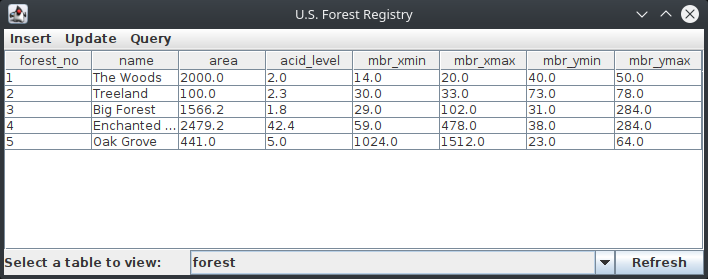
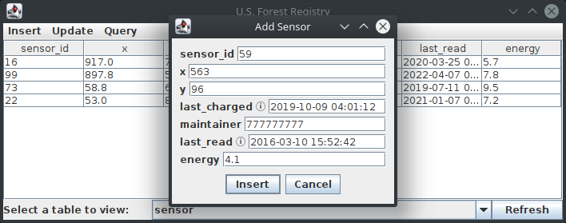

# U.S. Forest Registry

This is a graphical client that interacts with a fictional PostgreSQL database of U.S. Forests.
See `user_manual.pdf` for an overview of functionality. (This was done for a university course.)

## Dependencies

- Java 8 or newer
- PostgreSQL 10 or newer
- PostgreSQL JDBC driver (included in the `lib` directory!)

## How to run

1. In a PostgreSQL session, create a new database and execute `database_schema.sql` to set the database up with 
   the necessary schema.
2. Compile the Java code with `javac USForestRegistry/View.java`.
3. Run the Java code with `java -classpath lib/postgresql-42.3.3.jar:./ USForestRegistry.View`.

## Who wrote what?

I wrote everything here except the PostgreSQL JDBC driver -- that was written by the
PostgreSQL Global Development Group, and it has its own BSD 2-Clause License file in the `lib` directory.
It was originally obtained from [https://jdbc.postgresql.org/download.html](https://jdbc.postgresql.org/download.html).

For everything that I wrote, the MIT License in the repository root applies.